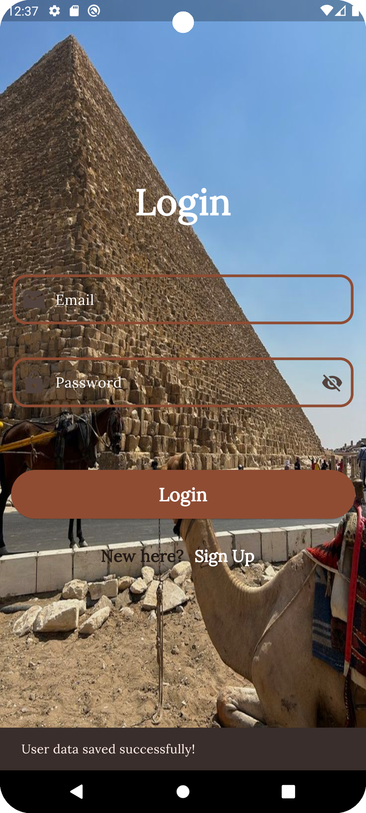
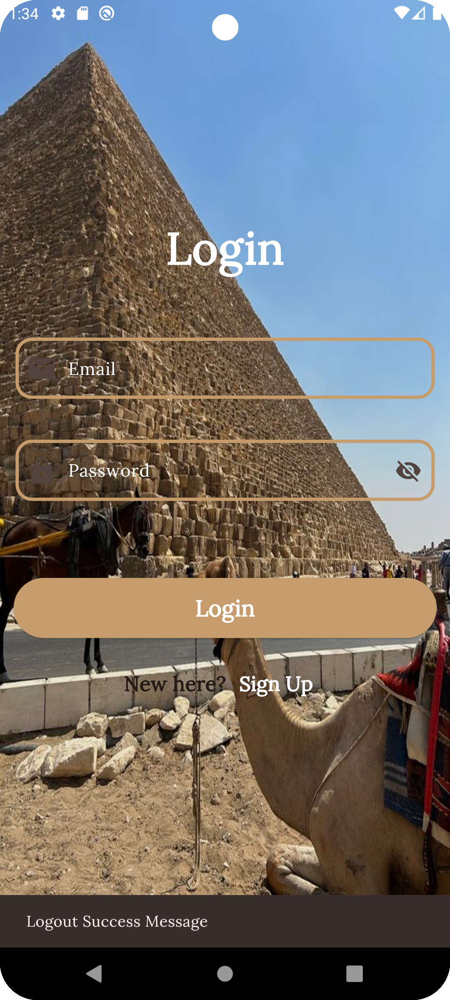
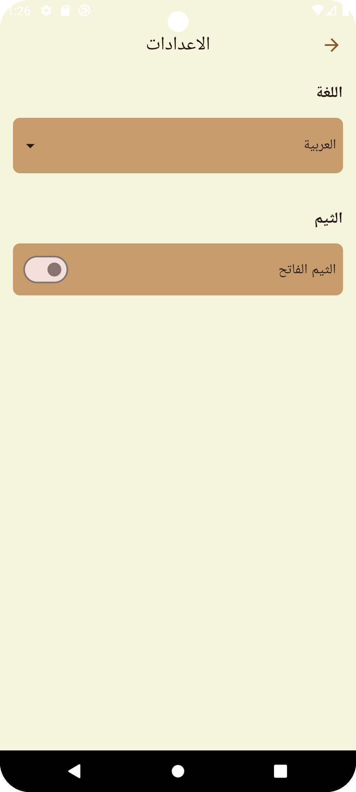
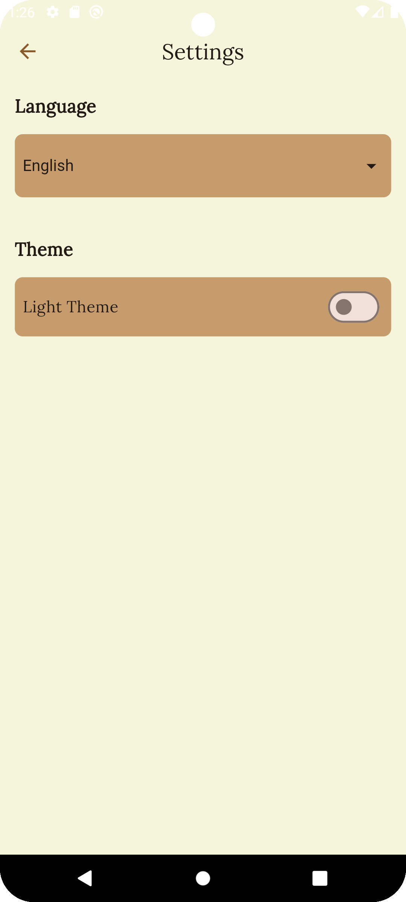

# Egypt Tourist Guide - Mobile Application

The Egypt Tourist Guide is a mobile application designed to provide tourists with an easy and
personalized way to explore Egypt's landmarks, museums, and attractions across different
governorates. The app features user-friendly navigation, a favorites system, and curated suggestions
to enhance the tourism experience.

---

## Features

### 1. Authentication

- *Signup Page*:
    - Input fields: Full Name, Email, Password, Confirm Password, Phone Number.
    - Data is saved locally, and users are redirected to the Login Page after signup.
- *Login Page*:
    - Input fields: Email, Password.
    - Validates user credentials and redirects to the Home Page upon successful login.

### 4. Profile Page

- Displays user information, including:
    - Full Name
    - Email
    - Address
    - Phone Number
    - Password (hashed for security).

### 8. Localization

- Supports both Arabic (Ar) and English (En).

### 9. Theme Customization

- Toggle between light and dark themes using ThemeBloc.

---

## State Management (Blocs)

The application employs flutter_bloc for efficient state management:

- *AuthBloc*:
    - States: AuthInitial, AuthLoading, AuthAuthenticated, AuthUnauthenticated, AuthError.
    - Events: LoginRequested, LogoutRequested.
- *ProfileBloc*:
    - States: ProfileInitial, ProfileLoading, ProfileLoaded, ProfileUpdated, ProfileError.
    - Events: LoadProfile, UpdateProfile, UpdateAvatar.
- *ThemeBloc*:
    - States: ThemeLight, ThemeDark.
    - Events: ToggleTheme.
- *ChangeLanguageCubit*:
    - States: ChangeLanguageState.

---

## Navigation Flow

- *Signup Page* → *Login Page* → *Home Page*
- *Home Page* → *Profile Page* → *Edit Profile Page*
- *Edit Profile Page* → *Settings Page*

---

# Flutter Packages Used in the Project

## 1. **flutter_bloc**

Provides state management for implementing BLoC (Business Logic Component).

- **Purpose**: Helps in managing and separating business logic from UI.
- **Documentation**: [flutter_bloc Documentation](https://pub.dev/packages/flutter_bloc)

## 2. **dio**

A powerful HTTP client for Dart, used for handling API requests.

- **Purpose**: Makes it easier to send HTTP requests, handle responses, and manage network errors.
- **Documentation**: [dio Documentation](https://pub.dev/packages/dio)

## 3. **intl**

Supports internationalization and localization for dates, numbers, and messages.

- **Purpose**: Helps in formatting dates, times, and messages according to the locale.
- **Documentation**: [intl Documentation](https://pub.dev/packages/intl)

## 4. **google_fonts**

Enables easy use of Google Fonts in the app.

- **Purpose**: Provides access to a wide range of custom fonts to enhance app design.
- **Documentation**: [google_fonts Documentation](https://pub.dev/packages/google_fonts)

## 5. **intl_phone_number_input**

A widget for phone number input with international formatting support.

- **Purpose**: Allows users to input and validate phone numbers in international formats.
- **Documentation
  **: [intl_phone_number_input Documentation](https://pub.dev/packages/intl_phone_number_input)

## 6. **flutter_localizations**

Provides tools for localizing Flutter apps for multiple languages.

- **Purpose**: Enables apps to support different languages and locales.
- **Documentation
  **: [flutter_localizations Documentation](https://docs.flutter.dev/development/accessibility-and-localization/internationalization)

## 7. **provider**

A simple state management solution for Flutter applications.

- **Purpose**: Offers a straightforward way to manage app state and share data between widgets.
- **Documentation**: [provider Documentation](https://pub.dev/packages/provider)

## 8. **shared_preferences**

Used for storing key-value data persistently on the device.

- **Purpose**: Allows saving small amounts of data like user preferences locally.
- **Documentation**: [shared_preferences Documentation](https://pub.dev/packages/shared_preferences)

---

## Architecture

The app is built using the *Clean Architecture*, ensuring a clear separation of concerns for better
maintainability and scalability.

- *Models*: Define the structure of data (e.g., Landmarks, Users).
- *Views*: Handle the UI components (e.g., screens and widgets).
- *Data*: Handle Data.
- *Services*: Handle business logic (e.g.,Landmark Service, User Service).

---

## File Structure

```plaintext
```
lib
├── data
├── generated
├── l10n
├── services
├── models
├── views
│ ├── blocs
│ │ ├── auth
│ │ ├── profile
│ │ ├── theme
│ │ ├── landmarks
│ │ └── favorite
│ ├── cubits
│ │ └── changeLanguage
│ ├── screens
│ └── widgets
└── main.dar

```
---
```
## User Profile Management

### Features

1. *API & Data Handling*:
    - Implemented using Dio for API requests.
    - Parsing and modeling JSON data.
    - Error handling using try-catch blocks.

2. *Add & Edit User*:
    - Full CRUD operations for user profiles: Create, Read, Update, and Delete.
    - Data caching with SharedPreferences for offline support.

3. *User Details*:
    - Pass data between screens efficiently.
    - Manage states for seamless user experience.

---

## Screenshots

| Login               | Sign              | Logout                | Profile                 | Localization                      |
|---------------------|-------------------|-----------------------|-------------------------|-----------------------------------|
|  |  |  |  |  |

| Settings                  | Theming                 |
|---------------------------|-------------------------|
|  |  |

---

